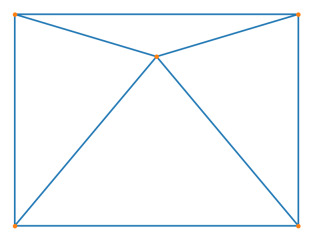
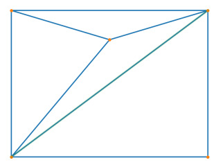

# cdtriang (Demo)

Experimental python bindings via cython for https://github.com/artem-ogre/CDT

### Install 

```
git clone git@github.com:maweigert/cdtriang.git
pip install -e cdtriang
```


### Usage


### unconstrained 

```python

import numpy as np 
import matplotlib.pyplot as plt

from cdtriang import triangulate

np.random.seed(42)
vertices = np.array([[0,0],[1,0],[1,1],[1.2,.5], [0,1]])

tri = triangulate(vertices)

plt.triplot(*vertices.T[::-1], tri, '.-', label='triangulation')
plt.axis([-.1,1.3,-.1,1.3])
plt.legend()

```



### constrained 

```python

from cdtriang import triangulate_constrained

np.random.seed(42)
vertices = np.array([[0,0],[0,1],[1,1],[1.2,.5], [1,0]])
edges = np.array([[0,1],[1,2],[2,3],[3,4], [4,0]])

tri = triangulate_constrained(vertices, edges)

plt.triplot(*vertices.T[::-1], tri, '.-')
plot(*np.moveaxis(vertices[edges],-1,1)[:,::-1].reshape((-1,2)), color='C2', lw=3, alpha=.2)
plt.axis([-.1,1.3,-.1,1.3])

plt.legend()

```




